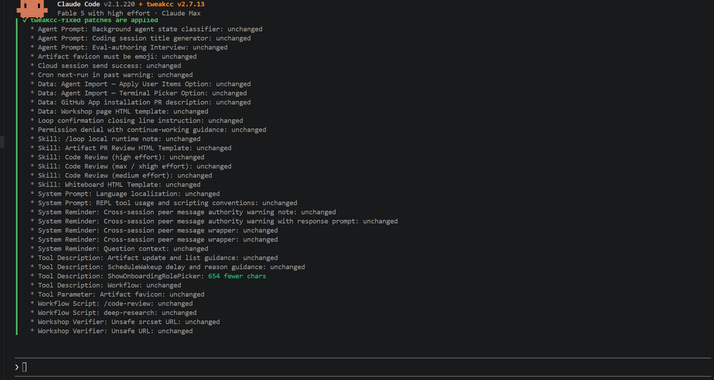

# tweakcc-gilligan

Dual-patcher skill and automated pipeline for Claude Code on Windows and Unix.

tweakcc-gilligan mechanizes the complete patch sequence for customizing Claude Code binaries. It combines `tweakcc-fixed` (code patches, `/clear-screen`, session memory, empty system-reminder suppression) with `unnerfcc` (system prompt un-nerfing, reasoning effort cap removal) and populates system-reminder overrides from `lobotomized-claude-code`.



## Architecture & Staged Workflow

Patching a binary cannot occur while an active Claude Code session holds the executable file open. tweakcc-gilligan implements a three-stage execution workflow to enforce this boundary cleanly:

### Stage 1: Preparation (Safe inside active Claude Code session)
Run the preparer to run preflight checks (Node 20+, disk space, running processes), check version catalog alignment, sync git repositories, build patchers, populate system reminders, and generate the external apply script:

```bash
python skills/tweakcc-update/scripts/install.py --prepare
```

### Stage 2: Apply Binary Patches (Outside active Claude Code session)
Run the generated external script with all Claude Code terminal and editor sessions closed:

- **Windows**: `%USERPROFILE%\.tweakcc-gilligan\apply-external.bat`
- **Unix**: `~/.tweakcc-gilligan/apply-external.sh`

Or invoke the installer directly in an external shell:

```bash
python skills/tweakcc-update/scripts/install.py --apply
```

### Stage 3: Verification
Confirm that dual version lines and sentinels for all three content sources are present in the installed binary:

```bash
python skills/tweakcc-update/scripts/verify.py
```

## Highlights

- **Unified Dual-Patcher Chain**: Applies code patches and prompt un-nerfs in the verified safe order (tweakcc-fixed first, unnerfcc second).
- **Windows PE & Unix Support**: Native PE (`claude.exe`) unpack/repack support ships from [brooksbUWO/unnerfcc](https://github.com/brooksbUWO/unnerfcc).
- **Three Content Sources**: Binds code features from `tweakcc-fixed`, prompt un-nerfs from `unnerfcc`, and reminder overrides from `lobotomized-claude-code`.
- **Runtime Isolation**: Operates under `~/.tweakcc-gilligan/` with process tree safety, PID tracking, and timestamped logs.

## Command Reference

- `python skills/tweakcc-update/scripts/install.py --prepare`: Syncs the patcher repositories (`unnerfcc` and `lobotomized-claude-code` fast-forward to their remotes; `tweakcc-fixed` is pinned to v2.7.38 so it matches the target binary format; a stale version-source clone stops the run), records the target Claude Code version to `~/.tweakcc-gilligan/target_version.txt`, populates system reminders, builds binaries, and generates the external apply script.
- `python skills/tweakcc-update/scripts/install.py --apply`: Resets Claude Code to the version prepare recorded (it refuses to run without that record), then applies tweakcc-fixed and unnerfcc patches to the installed binary.
- `python skills/tweakcc-update/scripts/verify.py`: Confirms dual version output (`claude --version`) and verifies markers from all three content sources in the executable.
- `python skills/tweakcc-update/scripts/check_version_intersection.py`: Reads the local catalog clones (falling back to GitHub) and npm to find the greatest common supported release.
- `python skills/tweakcc-update/scripts/install.py --clean-backup`: Removes poisoned tweakcc backup files if needed.
- `python skills/tweakcc-update/scripts/test_termination_contract.py`: Runs the black-box suite pinning the scripts' termination contract (`--max-seconds` ceiling, exit codes 0/1/2/3).

## Resetting to Stock

To return the binary to its un-modified published state:

```bash
npm install -g @anthropic-ai/claude-code@<version>
```

## Credits & Upstream Projects

tweakcc-gilligan builds on the work of the following upstream projects:
- [lukehutch/unnerfcc](https://github.com/lukehutch/unnerfcc): Prompt un-nerfing engine and Bun section packer.
- [skrabe/tweakcc-fixed](https://github.com/skrabe/tweakcc-fixed): Binary patcher for Claude Code features and UX customizations.
- [skrabe/lobotomized-claude-code](https://github.com/skrabe/lobotomized-claude-code): System-reminder override prompt set.

## License

MIT License. See [LICENSE](LICENSE) for details.
